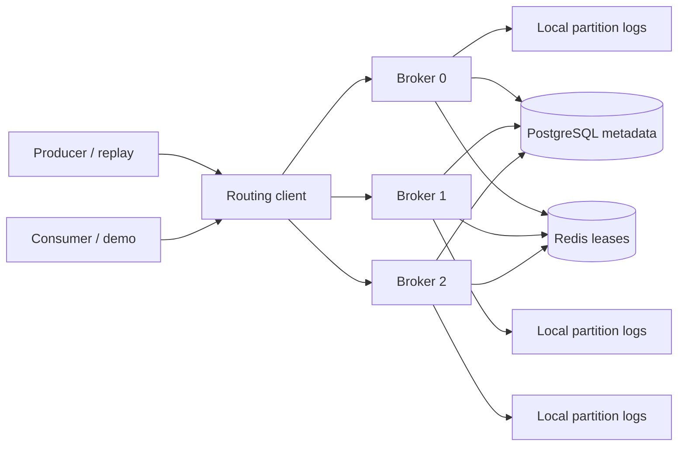

# StreamForge

A Go event-streaming broker built to study durable logs, partition routing, consumer coordination and failure handling. This is an **educational portfolio project, not production-ready infrastructure**.

**Current status: complete and verified for the educational portfolio scope.** All seven commands build, static analysis passes, and 50 leaf cases (17 real-database integration tests) pass normally and under race detection. Automatic retention, abrupt process recovery, executable CLI checks, the eight-workload benchmark matrix and payload-verified consumer-group replay are now supplied. Docker image build, six-service Compose health, the container demo and actual Prometheus scraping of all three brokers also passed. See [RESULTS.md](RESULTS.md), [design contracts](docs/DESIGN.md), [completion audit](docs/COMPLETION_AUDIT.md) and [file review](docs/FILE_REVIEW.md).

## What is implemented

- Persistent partition logs with record offsets, CRC checksums, segment rotation, sparse in-memory indexes,  restart scanning and opt-in automatic segment retention with durable retry pins.
- Three-broker operation with fixed partition ownership; keyed hashing, round-robin routing and explicit partition selection.
- Unary gRPC APIs for topics, publication, batches, reads, committed offsets, groups and failure scheduling.
- PostgreSQL metadata, monotonic next-offset commits, group generations and durable retry jobs.
- Redis membership leases with TTL expiry and generation fencing after membership changes.
- Delayed retries, capped exponential backoff and dead-letter topics carrying original-message provenance.
- Bounded requests, batches and fetches; JSON broker logging; dependency health and Prometheus text metrics.
- Seven executables: broker, admin, producer, consumer, demo, benchmark and replay.
- Tests using real databases, a deterministic mixed-operation stress test, forced standalone-process termination and actual producer/consumer executables; replay of an authentic GH Archive hour.

No replication, consensus, automatic failover, authentication, TLS or exactly-once processing guarantee is implemented. The consumer CLI performs one read pass; it is not a continuously polling consumer service.

## Architecture and guarantees



For a fixed broker list, partition `p` belongs to broker `p % brokerCount`. The client discovers owners from topic metadata and connects directly. A request sent to the wrong owner returns a gRPC error with owner information; the server does not proxy it. Changing the configured broker topology is not a supported live rebalance operation.

Ordering exists **within a partition**. Keyed publication uses FNV-1a hashing modulo partition count; unkeyed publication rotates across partitions. A partition mutex serializes appends and assigns contiguous offsets. There is no topic-wide order across partitions. Reads preserve records, allowing independent consumer groups to replay them.

A commit stores the **next offset to read**. After processing offset 7, commit 8. PostgreSQL makes commits monotonic; joining a new group starts independently. Generation and assignment checks fence stale group members. Applications must complete processing before committing and make side effects idempotent: a crash after a side effect but before its commit can cause redelivery.

`FSYNC_MODE=fsync` synchronizes the record file before acknowledgment. `write` acknowledges after a file write into the operating system's cache. Recovery scans records, checks framing/checksums and rebuilds indexes; corrupt or truncated records cause a startup error. Clean restart and abrupt standalone-process termination recovery are tested. Directory synchronization, automatic damaged-tail repair and power-loss durability are not established. Batch publication can leave a successful prefix if a later record fails.

Retry scheduling is durable in PostgreSQL. The worker publishes into `<topic>.retry` or `<topic>.dlq`, then marks the job complete. A crash between those steps can duplicate delivery. Processing a retry and failing it again requires a consumer action; the broker does not execute application handlers.

## Correctness fixes

| Audited problem | Current fix and regression |
|---|---|
| Windows case/path aliases | Topics require lowercase names and reject trailing dots/device basenames. API regressions check rejection and safe-topic restart/readback. Group/member names retain their existing case-sensitive contract. |
| Retry exhausts the 32-header allowance | The private retry path separately allows seven trusted internal headers. A real-database test preserves all 32 user headers through two retries and DLQ. |
| Forged `sf.*` provenance | External direct/batch publication rejects reserved headers, including case variants. Only the private worker path can supply internal provenance. |
| Payload/transport/fetch mismatch | Shared budgets support configured payloads up to 16 MiB, including record/request/response headroom. Network tests read back 5 MiB/16 MiB records, check maximum batch payload, over-limit rejection and restart. Oversized first records return an error rather than an empty success. |

These changes do not migrate legacy unsafe topic names or retroactively authenticate old producer-controlled headers. Back up and inspect existing data before upgrading; startup fails closed on rejected legacy topic names. Additional limitations and the original reproductions are recorded in [FILE_REVIEW.md](docs/FILE_REVIEW.md).

## Repository layout

| Path | Purpose |
|---|---|
| `cmd/` | Executable entry points |
| `internal/logstore/` | Framed logs, recovery, rotation, indexes and segment trimming |
| `internal/broker/`, `internal/server/` | API behavior, workers, request bounds and server lifecycle |
| `internal/metadata/` | PostgreSQL metadata and Redis coordination |
| `internal/client/`, `internal/cli/` | Owner routing and CLI connections/output |
| `internal/config/`, `internal/domain/`, `internal/retry/` | Configuration, validation and backoff |
| `internal/metrics/`, `internal/replay/` | Telemetry and event-envelope ingestion |
| `api/proto/`, `api/gen/` | API schema and included generated Go code |
| `migrations/` | Embedded initial PostgreSQL schema |
| `tests/integration/` | Real-database cluster and stress tests |
| `scripts/`, `Makefile` | Build, generation, verification and demonstration commands |
| `docker/`, `docker-compose.yml` | Image, seven Compose services and Prometheus config |
| `docs/` | Completion and file-boundary audits |
| `data/` | Dataset documentation; ignored raw/local/broker runtime directories |
| `.tools/`, `bin/`, `artifacts/` | Ignored local tools, binaries and verification evidence |

The Go package graph contains 21 project packages, all inside this root. It contains no sibling-project source or nested project root. Diagnostic Go helpers live under underscore-prefixed artifact directories to exclude them from `go test ./...`. Third-party dependency/tool files are required external components; they were not individually reviewed line by line. This folder currently has no independent `.git` repository.

## Build on Windows

Run from this directory. The existing local setup has Go, PostgreSQL, Redis and generated protobuf code. The tool/cache directories are ignored and will not accompany a future clone. A fresh machine needs compatible Go and database installations; build/test scripts do not install those dependencies. Optional Windows Docker/WSL setup is supplied separately. The module requires Go 1.25 or later; the audited build used Go 1.27.1.

```powershell
powershell.exe -NoProfile -ExecutionPolicy Bypass -File scripts/build.ps1
```

This builds `bin/streamforge-<name>.exe` for all seven commands. The process-scoped execution-policy option permits these scripts without changing the machine policy. Ordinary builds do not require protoc because generated files are included.

To regenerate the API, install protoc and run `scripts/generate.ps1` with the same invocation style. It uses pinned Go generators. The audit used protoc 29.3, protoc-gen-go 1.36.8 and protoc-gen-go-grpc 1.5.1; fresh output matched both included files exactly.

### Local three-broker demonstration

This path uses the portable databases already installed in this workspace. The PostgreSQL helper uses trust authentication on loopback for local development. Use a separate local Redis instance for each StreamForge cluster: lease keys currently have no cluster namespace.

```powershell
powershell.exe -NoProfile -ExecutionPolicy Bypass -File scripts/local-services.ps1 start
```

In **each of three PowerShell terminals**, enter this setup from the project root. Set `$brokerNumber` to 0, 1 and 2 respectively, then run the broker in the foreground:

```powershell
$brokerNumber = 0
$env:POSTGRES_DSN = 'postgres://streamforge@127.0.0.1:55432/streamforge?sslmode=disable'
$env:REDIS_ADDR = '127.0.0.1:56379'
$env:BROKER_LIST = '127.0.0.1:9001,127.0.0.1:9002,127.0.0.1:9003'
$env:BROKER_ID = "$brokerNumber"
$env:BROKER_ADDRESS = '127.0.0.1:' + (9001 + $brokerNumber)
$env:METRICS_ADDRESS = '127.0.0.1:' + (9101 + $brokerNumber)
$env:DATA_DIR = 'data/brokers/' + $brokerNumber
$env:FSYNC_MODE = 'fsync'
.\bin\streamforge-broker.exe
```

Use a fourth terminal for clients:

```powershell
.\bin\streamforge-demo.exe --broker 127.0.0.1:9001
.\bin\streamforge-admin.exe create-topic --topic orders --partitions 3
.\bin\streamforge-producer.exe --topic orders --key customer-42 --message 'order-created:42'
.\bin\streamforge-consumer.exe --topic orders --group orders-reader --member reader-1 --from committed
Invoke-WebRequest http://127.0.0.1:9101/healthz
Invoke-WebRequest http://127.0.0.1:9101/metrics
```

Use Ctrl+C to stop foreground brokers. Local database shutdown is available through `scripts/local-services.ps1 stop` when those services are no longer needed. The audit's brokers were stopped after execution; do not assume they are still running. Environment changes made in a child PowerShell script do not configure its parent shell, which is why the broker commands explicitly set their environment. The broker does not automatically load `.env`.

### Docker Compose

**Container build and execution verified on 6 October 2026.** WSL 2.7.13 and Docker Desktop 4.94.0 were installed during completion work; Docker Engine 29.8.2 and Compose 5.5.1 started the supplied Linux stack successfully. Optional setup: `powershell.exe -NoProfile -ExecutionPolicy Bypass -File scripts/setup-docker.ps1`. It may request Windows administrator approval and never automatically restarts the computer. Use [RESULTS.md](RESULTS.md) for the latest observed setup state.

Copy `.env.example` to `.env` and set a local `POSTGRES_PASSWORD` containing URI-safe characters, such as a generated hexadecimal password. Compose interpolates it directly into the database URL.

```powershell
Copy-Item .env.example .env
# Edit .env to set POSTGRES_PASSWORD before continuing.
docker compose up -d --build --wait
docker compose --profile tools run --rm tools
docker compose --profile tools run --rm --entrypoint admin tools create-topic --broker broker-1:9001 --topic orders --partitions 3
docker compose ps
```

For an isolated build/demo/health/Prometheus check, run `powershell.exe -NoProfile -ExecutionPolicy Bypass -File scripts/verify-docker.ps1` after the Docker engine is running. It chooses separate host ports and its own Compose project, removes only that test project and volumes, and saves evidence under `artifacts/docker/`. Default Compose host ports are configurable through POSTGRES_PORT, REDIS_PORT, BROKER_1_PORT..BROKER_3_PORT, METRICS_1_PORT..METRICS_3_PORT and PROMETHEUS_PORT.

The tools container uses advertised internal addresses `broker-1:9001` through `broker-3:9001`. Host CLIs cannot resolve these Docker service names; run cluster clients in the tools container for this configuration. Prometheus is configured at `http://127.0.0.1:9090`; the isolated verification confirmed three healthy targets and successful scrapes. `docker compose down` stops the stack; named volumes persist. Avoid deleting volumes if you need their data.

## Tests and measurements

The integration gate is `STREAMFORGE_INTEGRATION=1`. Without it, integration tests can skip. Set database endpoints for the local services explicitly:

```powershell
powershell.exe -NoProfile -ExecutionPolicy Bypass
. .\scripts\env.ps1
$env:GOFLAGS = '-buildvcs=false'
$env:POSTGRES_DSN = 'postgres://streamforge@127.0.0.1:55432/streamforge?sslmode=disable'
$env:REDIS_ADDR = '127.0.0.1:56379'
$env:STREAMFORGE_INTEGRATION = '1'
go test -count=1 ./...
go vet ./...
go mod verify
```

Race verification requires `CGO_ENABLED=1` and a working C compiler. On this Windows machine GCC's manifest path failed inside a directory containing spaces; a temporary compiler extraction into a path without spaces enabled the audit run. `scripts/verify.ps1 -Integration` fails if race testing fails or is unavailable. It can extract the existing optional `.tools/gcc.zip` into a task-owned temporary path without spaces and remove it afterward; fresh clones need a working compiler. It saves normal/race JSON logs and verifies dependency integrity. See [RESULTS.md](RESULTS.md) for successful execution evidence.

To reproduce the eight-workload matrix with automatic isolated local brokers, first build the binaries and start PostgreSQL/Redis, then run:

```powershell
powershell.exe -NoProfile -ExecutionPolicy Bypass -File scripts/benchmark.ps1 -ReplayArchive data/raw/2015-01-01-15.json.gz
```

It covers 10k/100k/500k messages, 100/1024/10240-byte payloads, 1/3/10 partitions and one/three API brokers. Large cases use write mode; smaller cases measure fsync separately. It saves a unique report directory, stops only its own broker processes and drops only its isolated SQL schemas. Log data remains ignored for inspection. This is a coverage matrix, not the full Cartesian product. [Machine-readable observations](docs/benchmark-results.json) accompany RESULTS. Windows timing uses QueryPerformanceCounter; other platforms use Go's monotonic clock.

With local brokers running, individual examples are:

```powershell
.\bin\streamforge-benchmark.exe --mode raw --messages 10000 --size 1024 --partitions 1 --durability fsync
.\bin\streamforge-benchmark.exe --mode api --messages 10000 --size 100 --partitions 3 --durability fsync
go test -run '^$' -bench BenchmarkAppend -benchtime=500x -benchmem ./internal/logstore
```

The API benchmark's durability flag labels the run; it does not reconfigure the broker. Configure `FSYNC_MODE` on the brokers first. A raw run measures local log operations; an API run includes routing, gRPC and metadata overhead. Do not compare the recorded runs as equivalent workloads: their payload sizes differ.

Replay requires the downloaded archive and an empty topic:

```powershell
.\bin\streamforge-admin.exe create-topic --topic archive.events --partitions 3
.\bin\streamforge-replay.exe --file data/raw/2015-01-01-15.json.gz --topic archive.events --limit 0
```

See [data documentation](data/README.md) for source and provenance. Reusing a nonempty topic fails verification. Parsing streams records; digest/count state uses O(partitions) auxiliary memory. Readback verifies SHA-256 equality of ordered offsets, keys and payloads, joins an exclusive consumer group, heartbeats, commits batches and checks committed resume and zero remaining lag. `--limit 0` reads the entire file; use a fresh exclusive group (the default generates one).

## Design boundaries and future work

Log append is O(record bytes), with occasional rotation/fsync. Startup scans all retained log bytes and rebuilds O(records / index interval) index entries. Seeking binary-searches segments and sparse entries, then scans nearby records. Fetch additionally copies the returned payloads. Group reassignment sorts members and visits partitions. Replay verification uses O(partition count) auxiliary memory plus bounded input/fetch buffers. PostgreSQL and network costs are additional to these in-process bounds.

RETENTION_MAX_SEGMENTS defaults to 0 (disabled). Set a positive count and RETENTION_INTERVAL (default 1m) for automatic inactive-segment trimming. Pending durable retries pin source segments, making the count a soft limit until dispatch completes. Consumer lag does not pin records: expired reads explicitly return OutOfRange. There is no topic deletion workflow. All retained segment handles stay open. Recovery fails closed on corruption; clean shutdown drains RPCs with a timeout, stops workers and closes logs/databases, but an acknowledgment can be ambiguous if cancellation races with an already-started write.

The original educational deliverable is complete: source, native and Docker services, actual Prometheus scraping, recovery, retention, CLI behavior, authentic replay, workload coverage and documentation are verified. scripts/verify-docker.ps1 reproduces the container checks and removes its own temporary test stack; the normal user stack is started separately with the commands above. The four audited bugs have fixes/regressions, and failed retry jobs no longer block other selected jobs in the same worker pass. [Detailed design contracts](docs/DESIGN.md) explain the remaining bounded-selection fairness limit. Production evolution would additionally need namespace isolation, replication/quorum acknowledgment, leader election and fencing, controlled reassignment, security and operational recovery procedures. These are future work, not current guarantees.

## Documentation

- [RESULTS.md](RESULTS.md): verified tests, benchmarks, replay and evidence limitations.
- [verification-results.json](docs/verification-results.json) and [benchmark-results.json](docs/benchmark-results.json): compact machine-readable verification and measurements.
- [COMPLETION_AUDIT.md](docs/COMPLETION_AUDIT.md): original audit with a follow-up noting newly supplied documentation.
- [FILE_REVIEW.md](docs/FILE_REVIEW.md): original file inventory, folder scope and defect-fix follow-up.
- [DESIGN.md](docs/DESIGN.md): implemented design, locking/lifecycle/durability/size contracts, complexity and future architecture.
- [data/README.md](data/README.md) and [data/PROVENANCE.json](data/PROVENANCE.json): authentic dataset details.
- `LEARNING_GUIDE.md`: private local 65-part study/interview guide in this root. It is intentionally listed in `.gitignore` and `.dockerignore`; it is not part of a future public checkout.

No project license has been selected. Public availability of an archive is not a blanket license for every event's content. Keep raw data, local tools, credentials and audit artifacts out of a public repository.
